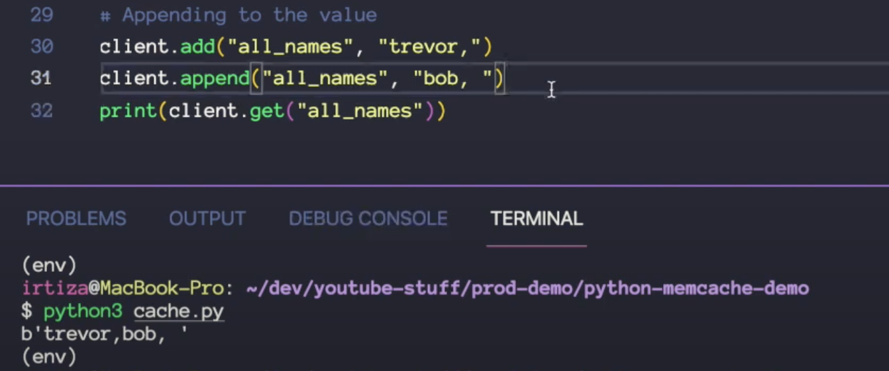

# Server Cache in nod

```
const express = require('express')
const fetch = require('node-fetch')

const NodeCache = require('node-cache')

const myCache = new NodeCache({ stdTTL:10 })

const app = express();
const port =3000;

```


with cache


# Redis


##


# Memcache


## code
brew install memcache
pip install pymemcache

```
from pymemcache.client import base
client = base.Client('localhost',12)

client.set("user1", xyz, expire=3)
print(client.get("user1"))
```


## important methods
- client.incr("visits",1)
- client.decr("visits",1)
- LPUSH -> left push
- LRANGE <var> start stop
- add/append




