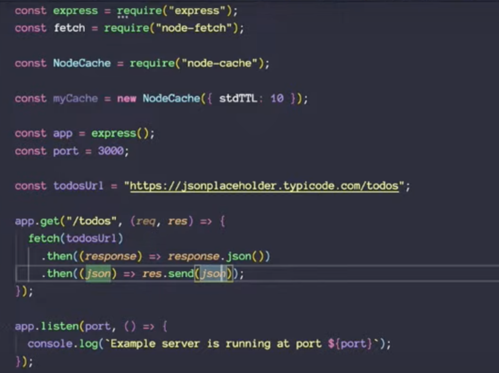
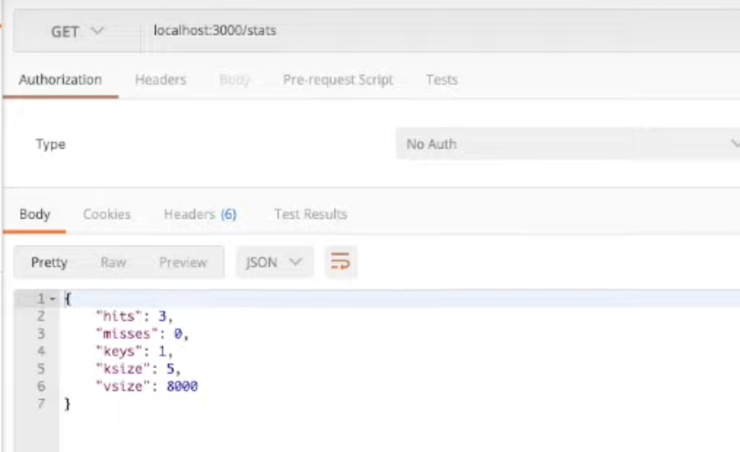
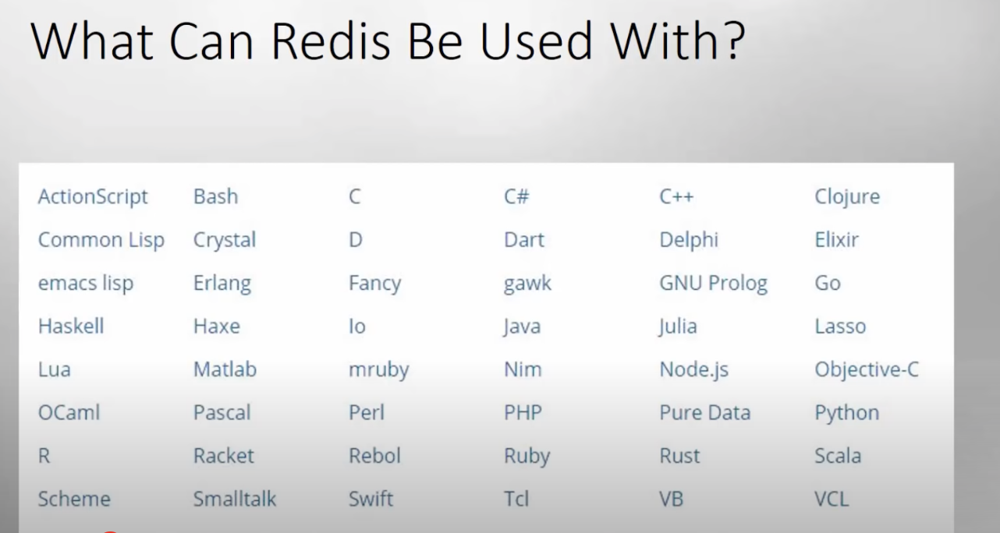
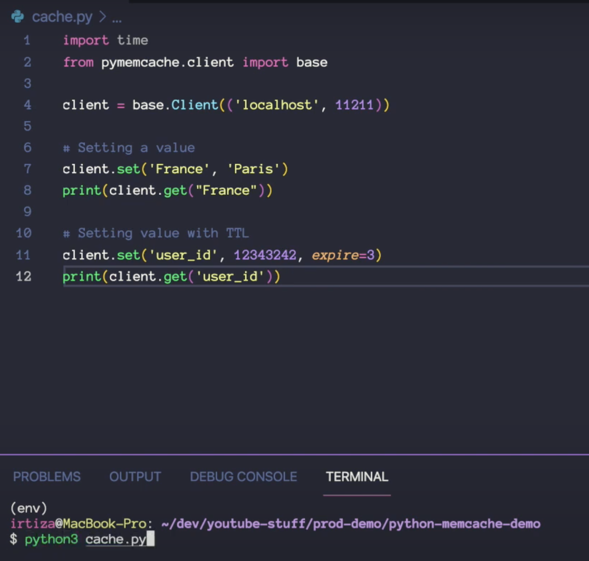

# Server Cache in nod

```
const express = require('express')
const fetch = require('node-fetch')

const NodeCache = require('node-cache')

const myCache = new NodeCache({ stdTTL:10 })

const app = express();
const port =3000;

```


with cache




# Redis
- Written in C
- 1.5 Million ops/second, less <1 ms 
- open source, in memory, noSQL key value store
- supports multiple data structure - String, List. Set, Sorted sets, hashes, bitmaps, hyper logs, geospatial indexes
- replication
- support bigger usecase than memcache

```
- Redis is an open-source, in-memory NoSQL database created by Salvatore Sanfilippo in 2009.
- Redis is known for its exceptional speed and is often used as a cache.
- Redis can store various data structures, including strings, lists, sets, sorted sets, hashes, bitmaps, and hyperloglogs.
- It provides 160 commands, including specialized high-performance commands designed for efficient data retrieval.
- Redis allows the use of Lua scripts for custom operations, which are executed in memory on the server.
- Redis has numerous use cases, such as storing sessions, tracking visitors, pub/sub messaging, and real-time data analysis.
- Many well-known companies, including Instagram, Pinterest, Stack Overflow, and Docker, utilize Redis for its speed and versatility.
```
```
- Redis can be used for storing data for web applications, such as item listings, real-time metrics, binary files, and social network functionality.
- Redis provides various data manipulation functions, including push, pop, tagging information, random number generation, and sorted sets for leaderboard functionality.
- HyperLogLog is a data structure in Redis used for estimating word occurrences without storing all the data in memory.
- Redis can be replicated across multiple servers, but network latency may become a concern in cross-continent replication scenarios.
- Redis Labs offers sharding and memory allocation optimizations for better performance and scalability.
- Storing session data on a separate server is recommended to minimize network traffic and maintain an updated cache across web servers.
```

##




## setup and code

```
sudo apt-get install redis-server


```

##


# Memcache
- Create by Danja in 2003 for LiveJournal website
- in memmory storage
- key value based

## code


```
brew install memcache
pip install pymemcache

from pymemcache.client import base
client = base.Client('localhost',12)

client.set("user1", xyz, expire=3)
print(client.get("user1"))
```




## important methods
- client.incr("visits",1)
- client.decr("visits",1)
- LPUSH -> left push
- LRANGE <var> start stop
- add/append


