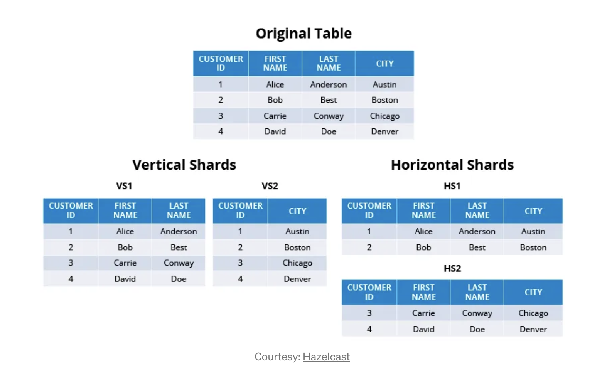

# Sharding

##

- popular technique for database performance optimization
- Sharding is often applied to caching and database layer. Other computing paradigms — stream processing system like Apache Spark, batch processing system like Map Reduce or other in-memory systems like elastic search.
-  Often employed by companies having massive user base; high volume of requests & data to process.

## 2 types of sharding:

Horizontal sharding is effective when queries tend to return a subset of rows that are often grouped together. For example, queries that filter data based on short date ranges are ideal for horizontal sharding since the date range will necessarily limit querying to only a subset of the servers.

Vertical sharding is effective when queries tend to return only a subset of columns of the data. For example, if some queries request only names, and others request only addresses, then the names and addresses can be sharded onto separate servers.

## Terminologies

General Definition of Key Terminologies
Different systems use different terminologies to denote shards. We will use the following definitions:

Shard / Logical Shard: A chunk of data (or entry, record etc) logically grouped together is called a shard. A shard key / partition key is something which is common across every entry that lands into a shard.

Physical Shard: A physical machine that generally hosts multiple logical shards.

Re-Sharding: It’s a process of splitting an existing shard into smaller shards and move those shards from one node to another in-order to balance the system.

Partitioned Data: When data is distributed across multiple logical or physical shards, it’s called partitioned data.

